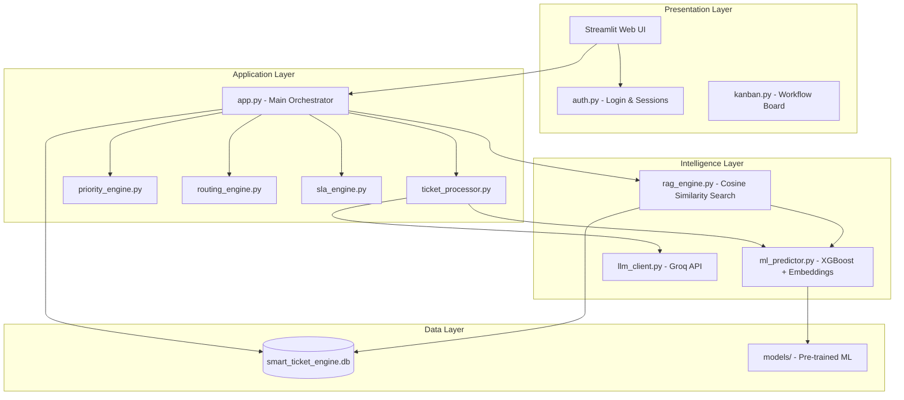
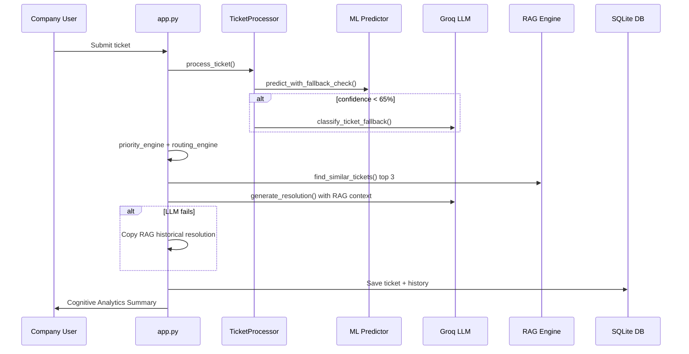
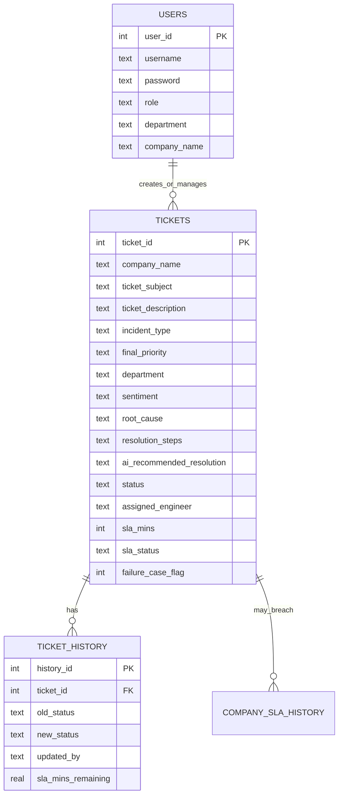

# Smart Ticket Understanding Engine
## Complete Project Report Template

> **How to use this document:** Fill in bracketed placeholders (`[like this]`), add your name/institution on the cover page, insert screenshots where indicated, and expand sections marked *\[Expand as needed\]*. Content below is derived from the project README and codebase.

---

## Cover Page

| Field | Details |
|-------|---------|
| **Project Title** | Smart Ticket Understanding Engine — An Intelligent Service Desk Management Platform |
| **Subtitle** | Hybrid ML, RAG, and LLM-Based Ticket Classification, Routing, and Resolution |
| **Submitted By** | [Your Name] |
| **Student ID / Roll No.** | [Your ID] |
| **Department** | [Your Department] |
| **Institution** | [College / University Name] |
| **Academic Year** | [e.g., 2025–2026] |
| **Guide / Supervisor** | [Guide Name, Designation] |
| **Submission Date** | [Date] |

---

## Declaration

I hereby declare that this project report entitled **"Smart Ticket Understanding Engine"** is an original work carried out by me under the guidance of **[Guide Name]**. This work has not been submitted elsewhere for the award of any degree or diploma.

**Signature:** ___________________  
**Name:** [Your Name]  
**Date:** [Date]

---

## Certificate

This is to certify that the project work entitled **"Smart Ticket Understanding Engine"** submitted by **[Your Name]** in partial fulfillment of the requirements for **[Degree / Course Name]** is a record of bonafide work carried out under my supervision.

**Signature of Guide:** ___________________  
**Name:** [Guide Name]  
**Designation:** [Designation]  
**Date:** [Date]

---

## Acknowledgement

*[Write 1–2 paragraphs thanking your guide, institution, peers, and family. Example starter:]*

I would like to express my sincere gratitude to **[Guide Name]** for continuous guidance and support throughout this project. I am also thankful to **[Department / Institution]** for providing the resources and environment to complete this work. Special thanks to my peers and family for their encouragement.

---

## Abstract

Traditional IT service desks struggle with manual ticket triage, inconsistent routing, slow resolution, and poor SLA visibility. **Smart Ticket Understanding Engine** addresses these challenges through an intelligent platform that combines **machine learning (XGBoost)**, **semantic retrieval (RAG)**, and **large language model reasoning (Groq LLM)** to automate ticket classification, department routing, priority assignment, and resolution recommendations.

The system uses Sentence Transformers (`all-MiniLM-L6-v2`) to embed ticket text, XGBoost classifiers to predict category, priority, department, and sentiment with confidence scores, and Groq (`llama-3.3-70b-versatile`) as a fallback when ML confidence falls below 65% and as the primary engine for root-cause analysis and resolution steps. A RAG layer retrieves the top three similar resolved historical tickets from SQLite, which the LLM uses as context to generate tailored recommendations. When the LLM is unavailable, the system gracefully falls back to copied historical resolutions.

The platform is built with **Python** and **Streamlit**, uses **SQLite** for persistence, and provides role-based portals for **Admin**, **Department Users**, and **Company Users**. Features include Kanban workflow management, SLA tracking with breach detection and company-level auto-escalation, executive dashboards, audit logs, a root-cause knowledge base, and a continuous learning loop for model improvement signals.

**Keywords:** Service Desk, ITSM, Machine Learning, XGBoost, RAG, LLM, Groq, Streamlit, SLA Management, Ticket Classification

---

## Table of Contents

1. [Introduction](#1-introduction)
2. [Problem Statement](#2-problem-statement)
3. [Objectives](#3-objectives)
4. [Scope of the Project](#4-scope-of-the-project)
5. [Literature Review / Background Study](#5-literature-review--background-study)
6. [System Analysis](#6-system-analysis)
7. [System Requirements](#7-system-requirements)
8. [System Design](#8-system-design)
9. [Technology Stack](#9-technology-stack)
10. [Implementation Details](#10-implementation-details)
11. [Intelligence Pipeline](#11-intelligence-pipeline)
12. [Database Design](#12-database-design)
13. [User Roles and Features](#13-user-roles-and-features)
14. [Testing and Validation](#14-testing-and-validation)
15. [Results and Discussion](#15-results-and-discussion)
16. [Deployment and Setup](#16-deployment-and-setup)
17. [Limitations](#17-limitations)
18. [Future Enhancements](#18-future-enhancements)
19. [Conclusion](#19-conclusion)
20. [References](#20-references)
21. [Appendices](#21-appendices)

---

## 1. Introduction

### 1.1 Overview

IT service desks receive large volumes of support requests across email, portals, and chat channels. Each ticket must be classified, prioritized, routed to the correct team, and resolved within agreed service levels. Manual handling is slow, error-prone, and does not scale.

**Smart Ticket Understanding Engine** is an intelligent **Service Desk Management Platform** that automates the cognitive workload of ticket understanding. It applies a **hybrid ML/LLM architecture**: fast local ML models handle bulk classification, semantic search retrieves relevant historical cases, and an LLM synthesizes root cause and resolution guidance from that context.

### 1.2 Motivation

- Reduce mean time to route (MTTR) and mean time to mitigate (MTTM)
- Improve routing accuracy across nine specialized support departments
- Provide instant AI-assisted resolution guidance to engineers
- Enforce SLA compliance with real-time tracking and escalation
- Build organizational knowledge from resolved tickets via RAG

### 1.3 Core Idea

> **ML classifies tickets quickly → RAG retrieves similar historical cases → Groq synthesizes root cause and resolution steps using that context.** If Groq is unavailable, the system falls back to copied RAG recommendations.

---

## 2. Problem Statement

Modern enterprises face the following service desk challenges:

| Challenge | Description |
|-----------|-------------|
| **Manual triage** | Agents spend significant time reading and categorizing tickets |
| **Routing errors** | Tickets sent to wrong departments delay resolution |
| **Inconsistent priority** | Subjective priority assignment leads to SLA breaches |
| **Knowledge silos** | Past resolutions are not reused effectively |
| **Limited SLA visibility** | Leadership lacks real-time operational dashboards |
| **No learning loop** | Corrections and novel cases are not fed back into models |

This project proposes an integrated platform that addresses classification, routing, resolution recommendation, workflow management, and SLA governance in a single Streamlit application.

---

## 3. Objectives

### 3.1 Primary Objectives

1. Develop a **hybrid ML + LLM ticket classification** system with confidence-based fallback
2. Implement **RAG-based semantic search** over resolved tickets for context-aware recommendations
3. Build **Groq LLM integration** for root cause analysis, resolution steps, and next-action guidance
4. Create **priority and routing engines** with keyword override rules
5. Implement **SLA tracking** with breach detection and company-level auto-escalation
6. Deliver **role-based web portals** for Admin, Department Users, and Company Users
7. Provide **executive dashboards**, audit trails, and performance metrics

### 3.2 Secondary Objectives

1. Support continuous learning via outlier flagging and engineer corrections
2. Enable CSV/JSON export of ticket queues
3. Maintain graceful degradation when API keys or models are unavailable
4. Document setup, testing, and troubleshooting for reproducibility

---

## 4. Scope of the Project

### 4.1 In Scope

- Ticket submission, classification, routing, and resolution recommendation
- Kanban workflow: New → In Progress → Escalated → Done
- Multi-tenant access with three role types
- SQLite database with audit history
- Pre-trained ML models and RAG knowledge base population scripts
- Admin dashboards with Plotly visualizations

### 4.2 Out of Scope

- Production-grade authentication (passwords stored in plain text for demo)
- Real email/Gmail integration in main UI (simulator exists separately)
- Cloud deployment and horizontal scaling
- Real-time multi-user collaboration
- Automated in-app model retraining (offline script only)

---

## 5. Literature Review / Background Study

*[Expand as needed — add citations for your institution's format (IEEE, APA, etc.)]*

### 5.1 IT Service Management (ITSM)

ITSM frameworks (e.g., ITIL) define incident, request, problem, and change management processes. Service desks are the front line for incident intake and routing.

### 5.2 Machine Learning for Text Classification

XGBoost with dense text embeddings is a proven approach for multi-label ticket classification. Sentence Transformers provide semantic representations suitable for both classification features and similarity search.

### 5.3 Retrieval-Augmented Generation (RAG)

RAG combines information retrieval with generative LLMs: relevant documents are retrieved first, then the LLM generates answers grounded in that context—reducing hallucination and leveraging organizational knowledge.

### 5.4 Large Language Models in IT Support

LLMs can classify ambiguous tickets, draft resolution steps, and recommend escalation paths. Hybrid architectures use LLMs only when cheaper/faster ML models are uncertain, balancing cost and accuracy.

### 5.5 Related Work Summary

| Approach | Strength | Limitation |
|----------|----------|------------|
| Rule-based routing | Fast, interpretable | Brittle, high maintenance |
| Pure ML classification | Scalable, local inference | Struggles on novel phrasing |
| Pure LLM | Flexible language understanding | Cost, latency, API dependency |
| **Hybrid ML + RAG + LLM (this project)** | Speed + knowledge grounding + fallback | Requires curated historical data |

---

## 6. System Analysis

### 6.1 Existing System (Manual Service Desk)

- Tickets arrive via email or portal
- L1 agents manually read, tag, and forward tickets
- Engineers search wiki or ask colleagues for similar issues
- SLA tracked in spreadsheets or basic tools
- No unified AI-assisted resolution pipeline

### 6.2 Proposed System

An integrated Streamlit application where:

1. Company users submit tickets and receive instant **Cognitive Analytics Summary**
2. ML + optional LLM classify and route automatically
3. RAG finds similar resolved cases; Groq generates tailored resolution
4. Department users manage queues via Kanban and Resolution Panel
5. Admins monitor SLA, knowledge base, audit logs, and AI health

### 6.3 Feasibility Study

| Dimension | Assessment |
|-----------|------------|
| **Technical** | Feasible — mature Python ML/LLM ecosystem |
| **Economic** | Groq free tier available; models run locally |
| **Operational** | Single-command deployment via Streamlit |
| **Schedule** | Modular codebase supports incremental development |

---

## 7. System Requirements

### 7.1 Functional Requirements

| ID | Requirement |
|----|-------------|
| FR-01 | Users shall authenticate with username/password and role-based access |
| FR-02 | Company users shall submit tickets with subject, description, and channel |
| FR-03 | System shall classify tickets into category, priority, department, sentiment |
| FR-04 | System shall use LLM fallback when ML confidence &lt; 65% on any field |
| FR-05 | System shall retrieve top 3 similar resolved tickets via RAG |
| FR-06 | System shall generate root cause, resolution steps, escalation, and team recommendation |
| FR-07 | System shall apply keyword priority overrides (e.g., "server down" → High) |
| FR-08 | System shall route tickets using ML department + keyword rules |
| FR-09 | System shall track SLA timers and detect breaches |
| FR-10 | System shall auto-escalate priority for companies with ≥3 past SLA breaches |
| FR-11 | Department users shall update ticket status and assign engineers |
| FR-12 | Admins shall view system-wide dashboards, audit logs, and export queues |
| FR-13 | System shall flag outlier tickets when RAG similarity &lt; 15% |
| FR-14 | Engineers shall correct routing/category to signal continuous learning |

### 7.2 Non-Functional Requirements

| ID | Requirement |
|----|-------------|
| NFR-01 | Application shall run on Python 3.8+ (tested on 3.13) |
| NFR-02 | Minimum 4 GB RAM (8 GB recommended for RAG cache) |
| NFR-03 | System shall degrade gracefully without Groq API key |
| NFR-04 | First RAG query may take 10–30 s; cached queries &lt; 1 s |
| NFR-05 | UI shall use responsive wide layout with dark theme |
| NFR-06 | Database operations shall be persistent across sessions |

### 7.3 Hardware Requirements

| Component | Minimum | Recommended |
|-----------|---------|-------------|
| CPU | Multi-core processor | 4+ cores |
| RAM | 4 GB | 8 GB |
| Storage | 500 MB | 1 GB+ |
| Network | Internet for Groq API | Stable broadband |

### 7.4 Software Requirements

- Python 3.8+
- pip package manager
- Web browser (Chrome, Firefox, Edge)
- Groq API key (optional but recommended)

---

## 8. System Design

### 8.1 High-Level Architecture



### 8.2 Module Responsibilities

| Module | Responsibility |
|--------|----------------|
| `app.py` | Main Streamlit app, UI tabs, ticket creation pipeline, dashboards |
| `auth.py` | Login, logout, session layout |
| `database.py` | SQLite schema, CRUD, SLA helpers, audit logs |
| `ticket_processor.py` | Hybrid ML + LLM classification orchestration |
| `ml_predictor.py` | Sentence Transformer embeddings + XGBoost predictors |
| `llm_client.py` | Groq client: classify fallback, next action, resolution |
| `rag_engine.py` | Semantic similarity search over resolved tickets |
| `priority_engine.py` | ML priority + keyword overrides |
| `routing_engine.py` | ML department + keyword routing rules |
| `sla_engine.py` | SLA minutes and compliance evaluation |
| `kanban.py` | Kanban board renderer |

### 8.3 Data Flow Diagram (Ticket Submission)



### 8.4 Project Directory Structure

```
project-drona/
├── app.py                         # Main Streamlit application
├── auth.py                        # Login and session layout
├── database.py                    # SQLite schema, CRUD, SLA helpers
├── ticket_processor.py            # Hybrid ML + LLM classification pipeline
├── ml_predictor.py                # Sentence Transformers + XGBoost predictors
├── llm_client.py                  # Groq client (classify, next action, resolution)
├── rag_engine.py                  # Semantic similarity search
├── priority_engine.py             # ML + keyword priority resolution
├── routing_engine.py              # Department routing + overrides
├── sla_engine.py                  # SLA minutes and compliance helpers
├── kanban.py                      # Kanban board renderer
├── generate_dataset.py            # Synthetic ticket generator + constants
├── train_xgboost_model.py         # Train/retrain ML models
├── populate_database_from_csv.py  # Load historical tickets for RAG
├── populate_rag_memory.py         # Alternative RAG population script
├── preprocess_data.py             # Dataset preprocessing
├── filter_english_only.py         # English dataset filter
├── test_rag_engine.py             # RAG smoke tests
├── test_ai_classification.py      # Classification tests
├── requirements.txt
├── .env.example
├── models/                        # Trained models (pre-built)
│   ├── sentence_transformer_model/
│   ├── category_model.pkl
│   ├── priority_model.pkl
│   ├── department_model.pkl
│   ├── sentiment_model.pkl
│   └── *_label_encoder.pkl
└── Data/                          # Training and import datasets
    ├── train_data.csv
    ├── val_data.csv
    ├── test_data.csv
    └── aa_dataset-tickets-multi-lang-5-2-50-version.csv
```

---

## 9. Technology Stack

| Layer | Technology | Purpose |
|-------|------------|---------|
| **UI** | Streamlit | Web-based interactive dashboards and forms |
| **Language** | Python 3.8+ | Core application and ML pipeline |
| **Database** | SQLite (`smart_ticket_engine.db`) | Tickets, users, history, SLA records |
| **ML** | XGBoost, scikit-learn, joblib | Multi-field ticket classification |
| **NLP / Embeddings** | HuggingFace Sentence Transformers (`all-MiniLM-L6-v2`) | Text embeddings for ML and RAG |
| **LLM** | Groq API (`llama-3.3-70b-versatile`) | Classification fallback, resolution, next action |
| **RAG Search** | NumPy + scikit-learn cosine similarity | Semantic retrieval |
| **Charts** | Plotly | Executive and performance dashboards |
| **Config** | python-dotenv (`.env`) | API keys and model configuration |

### 9.1 Key Dependencies (`requirements.txt`)

- streamlit, pandas, numpy, scikit-learn, plotly, matplotlib
- xgboost, joblib, sentence-transformers
- groq, python-dotenv, textblob, requests

### 9.2 Legacy Components

- `gemini_engine.py` and `google-generativeai` — kept for reference; production path uses Groq only

---

## 10. Implementation Details

### 10.1 Authentication (`auth.py`)

- Session-based login via Streamlit `st.session_state`
- Three roles: **Admin**, **Department User**, **Company User**
- Role determines visible tabs and data scope (system-wide vs department vs company)

### 10.2 Ticket Creation Pipeline (`execute_ticket_creation_pipeline`)

When a ticket is submitted, the following steps execute in order:

1. **ML Classification** — `TicketProcessor` via Sentence Transformer → XGBoost
2. **Groq LLM fallback** — if any field confidence &lt; 65%
3. **Priority + Routing engines** — keyword overrides and department rules
4. **RAG retrieval** — `find_similar_tickets()` → top 3, filtered by dept/type/priority
5. **Groq resolution** — `generate_resolution()` using ticket + ML fields + RAG context
6. **RAG fallback** — copy root cause + resolution from top similar ticket if LLM fails
7. **Persist** — save to database and display Cognitive Analytics Summary

### 10.3 Three Separate Groq LLM Calls

| Method | When | Purpose |
|--------|------|---------|
| `classify_ticket_fallback()` | ML confidence &lt; 65% on any field | Replace low-confidence ML labels |
| `generate_next_action()` | Every ticket (if Groq available) | Agent guidance — **Hybrid Engine Recommendation** |
| `generate_resolution()` | Every ticket (if Groq available) | **Root cause + resolution steps** (uses RAG context) |

> **Important:** RAG always runs before Groq resolution. Groq does not replace RAG — it reads similar tickets as context and writes a new answer. Pure RAG fallback is indicated by `[Recommended Resolution (Based on Similar Ticket ID …)]`.

### 10.4 ML Classification Fields

| Field | Labels |
|-------|--------|
| **Category** | Incident, Request, Problem, Change |
| **Priority** | High, Medium, Low |
| **Department** | Infra Team, Desktop Support, Application Support, Database Team, Security Team, Messaging Team, IT Access Team, Service Desk L1, HR IT Team |
| **Sentiment** | Positive, Neutral, Negative, Urgent |

Each ML prediction includes a confidence score. Fields below **65%** trigger Groq `classify_ticket_fallback()`.

### 10.5 RAG Engine Details

| Aspect | Detail |
|--------|--------|
| **Knowledge base** | Resolved tickets in SQLite (`status = 'Done'` or `root_cause IS NOT NULL`) |
| **Embeddings model** | `all-MiniLM-L6-v2` (local `models/sentence_transformer_model/`) |
| **Search method** | Cosine similarity with optional filters (department, incident type, priority) |
| **Cache** | Embeddings cached in RAM after first search |
| **Outlier flag** | Top similarity &lt; 15% → `failure_case_flag = 1` |

### 10.6 Priority Engine

- Starts with ML-predicted priority
- Applies keyword overrides: `server down`, `security breach`, `vpn down`, `urgent` → **High**
- Company with ≥3 historical SLA breaches → auto-escalate one priority level

### 10.7 SLA Engine

| Priority | SLA (minutes) | SLA (human-readable) |
|----------|---------------|----------------------|
| High | 180 | 3 hours |
| Medium | 480 | 8 hours |
| Low | 960 | 16 hours |

SLA status tracked per ticket with breach detection and snapshots in audit history.

### 10.8 Kanban Workflow

```
New → In Progress → Escalated → Done
```

- Enterprise sorting: breached and high-priority tickets surface first
- Department filter for admin unified board
- Ticket cards show ID, subject, company, priority pill, SLA countdown, assigned engineer

---

## 11. Intelligence Pipeline

### 11.1 Pipeline Diagram

```
Ticket submitted
      │
      ▼
┌─────────────────────────────────────┐
│ 1. ML Classification (TicketProcessor) │
│    Sentence Transformer → XGBoost   │
│    category, priority, dept, sentiment│
└─────────────────────────────────────┘
      │  Any field confidence < 65%?
      ▼
┌─────────────────────────────────────┐
│ 2. Groq LLM classification fallback │  (optional)
│    classify_ticket_fallback()       │
└─────────────────────────────────────┘
      │
      ▼
┌─────────────────────────────────────┐
│ 3. Priority + Routing engines       │
│    keyword overrides, dept rules    │
└─────────────────────────────────────┘
      │
      ▼
┌─────────────────────────────────────┐
│ 4. RAG retrieval                    │
│    find_similar_tickets() → top 3   │
│    filtered by dept / type / priority│
└─────────────────────────────────────┘
      │
      ▼
┌─────────────────────────────────────┐
│ 5. Groq resolution (primary)        │
│    generate_resolution()              │
│    Input: ticket + ML fields + RAG  │
│    Output: root cause, steps, esc.  │
└─────────────────────────────────────┘
      │  LLM fails / no API key?
      ▼
┌─────────────────────────────────────┐
│ 6. RAG fallback                     │
│    Copy root cause + resolution     │
│    from top similar historical ticket│
└─────────────────────────────────────┘
      │
      ▼
Save ticket + show Cognitive Analytics Summary
```

### 11.2 Design Rationale for Hybrid Approach

| Component | Role | Why |
|-----------|------|-----|
| ML (XGBoost) | Fast, local, bulk classification | Low latency, no API cost |
| LLM (Groq) | Ambiguous cases + rich resolution text | Handles nuance ML misses |
| RAG | Grounds LLM in real resolved tickets | Reduces hallucination, reuses org knowledge |

---

## 12. Database Design

### 12.1 Entity-Relationship Overview



### 12.2 Table Descriptions

| Table | Purpose |
|-------|---------|
| `users` | Authentication and role-based access |
| `tickets` | Core ticket records with ML/AI fields and SLA data |
| `ticket_history` | Audit trail of status changes with SLA snapshots |
| `gmail_inbox_simulation` | Email-to-ticket simulation (auxiliary) |
| `company_sla_history` | Historical SLA breaches per company for auto-escalation |

### 12.3 Key Ticket Columns

- **Classification:** `incident_type`, `ml_priority`, `keyword_priority`, `final_priority`, `department`, `sentiment`
- **AI output:** `root_cause`, `resolution_steps`, `ai_recommended_resolution`, `escalation_required`
- **Workflow:** `status`, `assigned_engineer`, `engineer_remarks`
- **SLA:** `sla_mins`, `sla_status`, `resolution_time_mins`, `created_date`, `closed_date`
- **Learning:** `failure_case_flag` (outlier / correction signal)

---

## 13. User Roles and Features

### 13.1 Role Summary

| Role | Example Login | Access Scope |
|------|---------------|--------------|
| **Admin** | `admin` / `admin123` | Full system — all companies, departments, tickets |
| **Department User** | `desktop` / `desktop123` | Own department queue and metrics |
| **Company User** | `techcorp_user` / `techcorp123` | Submit tickets, view company archive and SLA |

### 13.2 Admin Portal (7 Tabs)

| Tab | Features |
|-----|----------|
| **1. All Support Tickets** | Search, filter, paginated table, CSV/JSON export, Resolution Panel |
| **2. Unified Kanban Board** | Cross-department workflow board with status columns |
| **3. Leadership SLA Dashboard** | KPI cards, workload charts, SLA compliance, radar index, capacity planner |
| **4. Root Cause Knowledge Base** | Browse proven resolutions feeding RAG; reuse frequency |
| **5. Audit Logs** | System-wide compliance trail (200 entries/page) |
| **6. Continuous Learning Loop** | Outlier review, retraining guidance, engineer correction signals |
| **7. Performance Metrics** | MTTR, MTTM, engineer performance, AI engine health, adoption % |

**Admin-only privileges:**
- Manage tickets from every department
- Re-open **Done** tickets from Kanban
- Executive dashboards and system-wide audit logs
- Export full ticket queue

### 13.3 Department User Portal

- Active Kanban Board (department queue)
- SLA Dashboard (department metrics)
- History Audit Trail
- Ticket Resolution Panel (assign engineer, update status, remarks)

### 13.4 Company User Portal

- Submit New Ticket (10 pre-filled sample tickets for AI testing)
- Company Tickets Archive
- Company SLA Insights
- Instant **Cognitive Analytics Summary** after submission

### 13.5 Ticket Resolution Panel (Admin + Department Users)

| Section | Capability |
|---------|------------|
| Ticket details | Subject, company, employee, description, channel, dates |
| AI insights | Incident type, sentiment, root cause, resolution, escalation, team |
| Similar tickets (RAG) | Live similarity search with expandable matches |
| SLA breach alert | Warning if company has past SLA violations |
| Resolve / Update | Status, engineer assignment, remarks |
| Continuous learning | Correct department routing and incident type |
| Per-ticket audit trail | Full status history with SLA snapshots |

### 13.6 Default User Accounts

**Admin & Department Users:**

| Username | Password | Role | Department |
|----------|----------|------|------------|
| `admin` | `admin123` | Admin | — |
| `infra` | `infra123` | Department User | Infra Team |
| `desktop` | `desktop123` | Department User | Desktop Support |
| `app` | `app123` | Department User | Application Support |
| `db` | `db123` | Department User | Database Team |
| `security` | `security123` | Department User | Security Team |
| `messaging` | `messaging123` | Department User | Messaging Team |
| `access` | `access123` | Department User | IT Access Team |
| `l1` | `l1123` | Department User | Service Desk L1 |
| `hrit` | `hrit123` | Department User | HR IT Team |

**Company Users:**

| Username | Password | Company |
|----------|----------|---------|
| `techcorp_user` | `techcorp123` | TechCorp Services |
| `tcs_user` | `tcs123` | TCS Global |
| `innotech_user` | `innotech123` | InnoTech Ltd |
| `finbank_user` | `finbank123` | FinBank Corp |
| `medsys_user` | `medsys123` | MedSystems |
| `cloud_user` | `cloud123` | CloudSphere |
| `edulearn_user` | `edulearn123` | EduLearn Inc |
| `apex_user` | `apex123` | Apex Retail |

---

## 14. Testing and Validation

### 14.1 Test Environment

| Item | Value |
|------|-------|
| OS | [e.g., Windows 10/11] |
| Python | [e.g., 3.13] |
| RAM | [e.g., 8 GB] |
| Groq API | [Configured / Not configured] |

### 14.2 Automated Test Commands

| Test | Command | Expected Result |
|------|---------|-----------------|
| Groq LLM connection | `python llm_client.py` | Prints `✓ Groq client initialized` and recommended action |
| Full hybrid pipeline | `python ticket_processor.py` | ML confidence scores, LLM fallback usage, next action |
| RAG engine | `python test_rag_engine.py` | Similar tickets returned with similarity scores |
| AI classification | `python test_ai_classification.py` | Category, priority, department, sentiment predictions |

### 14.3 Manual Test Scenarios

| # | Scenario | Steps | Expected Outcome |
|---|----------|-------|------------------|
| 1 | Company ticket submission | Login as `techcorp_user` → Submit sample ticket | Cognitive Analytics Summary with classification and resolution |
| 2 | ML-only mode | Remove `GROQ_API_KEY`, submit ticket | ML classification works; RAG fallback resolution format |
| 3 | Department Kanban | Login as `desktop` → Move ticket New → In Progress | Status updates; audit log entry created |
| 4 | SLA breach visibility | Submit High priority ticket, delay resolution | SLA status shows Breached; dashboard reflects breach |
| 5 | Admin export | Admin → All Support Tickets → Export CSV | Valid CSV with ticket queue |
| 6 | Outlier detection | Submit novel ticket unlike KB | `failure_case_flag = 1` in Continuous Learning tab |
| 7 | Engineer correction | Correct department in Resolution Panel | Ticket flagged for retraining signal |

### 14.4 Test Case Results Table

*[Fill in during your testing]*

| Test ID | Description | Status (Pass/Fail) | Remarks |
|---------|-------------|-------------------|---------|
| TC-01 | User login — Admin | [ ] | |
| TC-02 | User login — Department User | [ ] | |
| TC-03 | User login — Company User | [ ] | |
| TC-04 | Ticket classification | [ ] | |
| TC-05 | RAG similarity search | [ ] | |
| TC-06 | Groq resolution generation | [ ] | |
| TC-07 | SLA timer and breach | [ ] | |
| TC-08 | Kanban status workflow | [ ] | |
| TC-09 | Admin dashboard charts | [ ] | |
| TC-10 | CSV export | [ ] | |

---

## 15. Results and Discussion

*[Insert screenshots and measured outcomes. Use the tables below as templates.]*

### 15.1 Screenshots Checklist

- [ ] Login page
- [ ] Company user — ticket submission form
- [ ] Cognitive Analytics Summary after submission
- [ ] Admin — All Support Tickets table
- [ ] Admin — Unified Kanban Board
- [ ] Admin — Leadership SLA Dashboard
- [ ] Admin — Performance Metrics / AI Engine Status
- [ ] Ticket Resolution Panel with RAG similar tickets
- [ ] Department user — Kanban board
- [ ] Root Cause Knowledge Base

### 15.2 Sample Classification Output

*[Paste example from `python ticket_processor.py` or UI]*

| Field | Predicted Value | Confidence | Source |
|-------|-----------------|------------|--------|
| Category | [e.g., Incident] | [e.g., 0.92] | ML |
| Priority | [e.g., High] | [e.g., 0.78] | ML + keyword override |
| Department | [e.g., Desktop Support] | [e.g., 0.71] | ML |
| Sentiment | [e.g., Urgent] | [e.g., 0.55] | LLM fallback |

### 15.3 RAG Retrieval Example

| Rank | Similar Ticket ID | Similarity % | Department |
|------|-------------------|--------------|------------|
| 1 | [ID] | [e.g., 78%] | [Dept] |
| 2 | [ID] | [e.g., 65%] | [Dept] |
| 3 | [ID] | [e.g., 52%] | [Dept] |

### 15.4 Dashboard KPIs (Sample)

| Metric | Value |
|--------|-------|
| Total ticket volume | [N] |
| Active backlog | [N] |
| SLA met rate | [N]% |
| SLA breaches | [N] |
| Average resolution time | [N] mins |
| MTTR | [N] mins |
| AI adoption rate | [N]% |

### 15.5 Discussion

*[Analyze results:]*

- How effectively did hybrid ML/LLM classification handle ambiguous tickets?
- Did RAG context improve resolution quality vs pure LLM?
- What was the impact of keyword overrides on priority accuracy?
- How did the system behave without Groq API key (degradation path)?
- What outliers were detected and what do they suggest for retraining?

---

## 16. Deployment and Setup

### 16.1 Installation Steps

```bash
# 1. Install dependencies
pip install -r requirements.txt

# 2. Configure environment (copy .env.example to .env)
GROQ_API_KEY=your_groq_api_key_here
LLM_MODEL=llama-3.3-70b-versatile

# 3. (Optional) Retrain models
python train_xgboost_model.py

# 4. (Recommended) Populate RAG knowledge base
python populate_database_from_csv.py

# 5. Run application
streamlit run app.py
```

Open **http://localhost:8501**

### 16.2 First-Run Behavior

- Database schema created automatically
- Default users seeded
- Sentence Transformer loads into memory (~90 MB)
- Pre-trained models in `models/` used if present

### 16.3 Configuration Parameters

| Parameter | Location | Default |
|-----------|----------|---------|
| ML confidence threshold | `app.py` → `get_ticket_processor()` | 0.65 (65%) |
| LLM model | `.env` → `LLM_MODEL` | `llama-3.3-70b-versatile` |
| RAG outlier threshold | `rag_engine.py` | 15% similarity |
| RAG top-K results | Pipeline | 3 similar tickets |

### 16.4 Troubleshooting Summary

| Issue | Solution |
|-------|----------|
| Models not found | Run `python train_xgboost_model.py` |
| RAG format resolutions only | Set `GROQ_API_KEY` in `.env`, restart Streamlit |
| No similar tickets | Run `python populate_database_from_csv.py` |
| Slow first RAG query | Normal — embeddings computed once, then cached |
| Database corruption | Backup and delete `smart_ticket_engine.db`, restart, repopulate |

---

## 17. Limitations

1. **Demo-grade security** — Plain-text passwords; not suitable for production without hardening
2. **Single-user SQLite** — Not designed for high concurrent write loads
3. **Local embedding cache** — RAM-intensive; first query latency on large KB
4. **Offline retraining only** — In-app retraining disabled for memory safety
5. **Anonymized training data** — Imported CSV may contain `<tel_num>`, `<email>` placeholders
6. **Groq API dependency** — Full LLM resolution requires internet and API key
7. **English-focused** — Primary datasets filtered for English tickets
8. **No real email integration** — Gmail simulator exists but is not in main UI

---

## 18. Future Enhancements

1. **Production authentication** — OAuth2, hashed passwords, SSO integration
2. **Cloud database** — PostgreSQL / MySQL with connection pooling
3. **Real-time email ingestion** — Gmail/Outlook webhook → auto-ticket creation
4. **Automated retraining pipeline** — Scheduled jobs using engineer corrections and outliers
5. **Multi-language support** — Extend embeddings and training data beyond English
6. **Fine-tuned domain LLM** — Train on organization-specific ticket history
7. **Mobile-responsive UI** — Native app or PWA for field engineers
8. **Integration APIs** — REST endpoints for ServiceNow, Jira, Zendesk
9. **Advanced analytics** — Predictive SLA breach warnings, staffing forecasts
10. **Feedback loop UI** — Thumbs up/down on AI resolutions to improve RAG ranking

---

## 19. Conclusion

The **Smart Ticket Understanding Engine** successfully demonstrates how a **hybrid ML, RAG, and LLM architecture** can automate the most labor-intensive aspects of IT service desk operations. By combining fast local XGBoost classification, semantic retrieval over resolved tickets, and Groq-powered resolution synthesis, the platform delivers instant ticket understanding while maintaining graceful fallback when cloud AI is unavailable.

The multi-role Streamlit application provides end-to-end workflow support—from company ticket submission through department Kanban management to executive SLA dashboards—making it a complete proof-of-concept for intelligent service desk automation.

**Key achievements:**
- Automated classification of category, priority, department, and sentiment
- Context-aware resolution recommendations grounded in historical tickets
- SLA governance with breach tracking and company-level escalation
- Operational visibility through dashboards, audit logs, and performance metrics
- Continuous learning signals via outlier detection and engineer corrections

*[Add 1–2 sentences on personal learning outcomes and project impact.]*

---

## 20. References

*[Format per your institution — examples below use a generic style. Replace with real citations.]*

1. Chen, T., & Guestrin, C. (2016). XGBoost: A Scalable Tree Boosting System. *Proceedings of the 22nd ACM SIGKDD International Conference on Knowledge Discovery and Data Mining.*

2. Reimers, N., & Gurevych, I. (2019). Sentence-BERT: Sentence Embeddings using Siamese BERT-Networks. *Proceedings of EMNLP-IJCNLP.*

3. Lewis, P., et al. (2020). Retrieval-Augmented Generation for Knowledge-Intensive NLP Tasks. *Advances in Neural Information Processing Systems.*

4. Axelos. (2019). *ITIL Foundation, ITIL 4 Edition.* The Stationery Office.

5. Groq Inc. (2024). Groq API Documentation. https://console.groq.com/docs

6. Streamlit Inc. (2024). Streamlit Documentation. https://docs.streamlit.io/

7. Hugging Face. (2024). Sentence Transformers Documentation. https://www.sbert.net/

8. scikit-learn Developers. (2024). Cosine Similarity. https://scikit-learn.org/

9. *[Add course textbooks, papers, and websites you actually consulted]*

---

## 21. Appendices

### Appendix A: Glossary

| Term | Definition |
|------|------------|
| **ITSM** | IT Service Management |
| **SLA** | Service Level Agreement |
| **MTTR** | Mean Time To Resolve |
| **MTTM** | Mean Time To Mitigate |
| **RAG** | Retrieval-Augmented Generation |
| **LLM** | Large Language Model |
| **XGBoost** | Extreme Gradient Boosting — ML algorithm |
| **Kanban** | Visual workflow board for ticket status tracking |
| **Embedding** | Dense vector representation of text for similarity comparison |

### Appendix B: SLA and Priority Reference

| Priority | SLA (minutes) | Duration |
|----------|---------------|----------|
| High | 180 | 3 hours |
| Medium | 480 | 8 hours |
| Low | 960 | 16 hours |

**Keyword overrides (examples):** `server down`, `security breach`, `vpn down`, `urgent` → High

**Company escalation:** ≥3 historical SLA breaches → new tickets auto-escalated one priority level

### Appendix C: Environment Variables (`.env`)

```env
GROQ_API_KEY=your_groq_api_key_here
LLM_MODEL=llama-3.3-70b-versatile
```

### Appendix D: Sample Cognitive Analytics Output

*[Paste a real example after submitting a test ticket]*

```
Ticket ID: [N]
Category: [Incident]
Priority: [High]
Department: [Desktop Support]
Sentiment: [Urgent]
RAG Top Match: [Ticket ID] — [Similarity %]
Root Cause: [Generated root cause]
Resolution Steps:
1. [Step 1]
2. [Step 2]
Escalation Required: [Yes/No]
Recommended Team: [Team name]
```

### Appendix E: Code Snippets

#### E.1 ML Confidence Threshold (app.py)

```python
get_ticket_processor(confidence_threshold=0.65)
```

#### E.2 Ticket Processor Pipeline (ticket_processor.py)

```python
# 1. ML Classification with confidence check
ml_predictions, needs_llm_fallback, low_confidence_fields = \
    self.ml_predictor.predict_with_fallback_check(ticket_text)

# 2. LLM Fallback for low-confidence predictions
if needs_llm_fallback and self.llm_available:
    # classify_ticket_fallback()
```

### Appendix F: Additional Project Documentation

| File | Contents |
|------|----------|
| `QUICK_START.md` | Fast setup walkthrough |
| `RAG_SETUP_GUIDE.md` | RAG configuration and tuning |
| `COMPANY_USER_TESTING_GUIDE.md` | Sample tickets and test scenarios |
| `HOW_TO_POST_TICKETS.md` | API-style ticket submission examples |
| `GEMINI_TO_GROQ_MIGRATION.md` | Groq migration notes |

### Appendix G: User Manual Summary

**Quick test workflow:**
1. Run `streamlit run app.py`
2. Login as `techcorp_user` / `techcorp123`
3. Go to **Submit New Ticket**
4. Select a sample ticket from dropdown
5. Submit and review **Cognitive Analytics Summary**
6. Login as `admin` / `admin123` to view ticket in All Support Tickets or Kanban

---

## Report Writing Checklist

Use this checklist before final submission:

- [ ] Cover page completed with all fields
- [ ] Declaration and certificate signed
- [ ] Acknowledgement written
- [ ] Abstract within word limit (typically 150–300 words)
- [ ] All placeholders `[...]` replaced
- [ ] Screenshots inserted in Section 15
- [ ] Test case results filled in Section 14.4
- [ ] Sample outputs added in Section 15
- [ ] References formatted per institution guidelines
- [ ] Page numbers and header/footer added in Word/PDF export
- [ ] Spell-check and grammar review completed
- [ ] Guide reviewed and approved

---

*Document generated from project README and codebase analysis. Project path: `c:\project-drona`*
